# E-CLIP Module Entity Relationship Diagram

This ERD reflects the Laravel migrations in `database/migrations` as of August 5, 2026. It includes all E-CLIP-owned tables and the shared tables referenced by the module. Laravel's polymorphic `notifications` table is listed separately because it has no database foreign key to an E-CLIP table.

```mermaid
erDiagram
    FORMER_REBELS ||--o{ ECLIP_CASES : "has cases"
    MUNICIPALITIES o|--o{ ECLIP_CASES : "scopes"
    USERS ||--o{ ECLIP_CASES : "creates"
    USERS o|--o{ ECLIP_CASES : "is assigned"

    ECLIP_CASES ||--o{ ECLIP_ELIGIBILITY_REVIEWS : "receives"
    USERS ||--o{ ECLIP_ELIGIBILITY_REVIEWS : "performs"
    ECLIP_CASES ||--o{ ECLIP_STATUS_HISTORIES : "records"
    USERS ||--o{ ECLIP_STATUS_HISTORIES : "causes"

    ECLIP_DOCUMENT_REQUIREMENTS ||--o{ ECLIP_DOCUMENT_REQUIREMENT_HISTORIES : "has audit entries"
    USERS ||--o{ ECLIP_DOCUMENT_REQUIREMENT_HISTORIES : "changes"
    ECLIP_CASES ||--o{ ECLIP_DOCUMENTS : "requires"
    ECLIP_DOCUMENT_REQUIREMENTS ||--o{ ECLIP_DOCUMENTS : "classifies"
    ECLIP_DOCUMENTS ||--o{ ECLIP_DOCUMENT_VERSIONS : "has versions"
    USERS ||--o{ ECLIP_DOCUMENT_VERSIONS : "uploads"
    ECLIP_DOCUMENTS ||--o{ ECLIP_DOCUMENT_REVIEWS : "receives"
    ECLIP_DOCUMENT_VERSIONS ||--o{ ECLIP_DOCUMENT_REVIEWS : "is reviewed"
    USERS ||--o{ ECLIP_DOCUMENT_REVIEWS : "reviews"

    ECLIP_ASSISTANCE_CATEGORIES ||--o{ ECLIP_ASSISTANCE_CATEGORY_HISTORIES : "has audit entries"
    USERS ||--o{ ECLIP_ASSISTANCE_CATEGORY_HISTORIES : "changes"
    ECLIP_CASES ||--o| ECLIP_ASSISTANCE_REQUESTS : "has"
    USERS ||--o{ ECLIP_ASSISTANCE_REQUESTS : "creates"
    ECLIP_ASSISTANCE_REQUESTS ||--o{ ECLIP_ASSISTANCE_REVISIONS : "has revisions"
    ECLIP_ASSISTANCE_CATEGORIES ||--o{ ECLIP_ASSISTANCE_REVISIONS : "classifies"
    USERS ||--o{ ECLIP_ASSISTANCE_REVISIONS : "creates"

    ECLIP_CASES ||--o{ ECLIP_DILG_REVIEWS : "receives"
    ECLIP_ASSISTANCE_REQUESTS ||--o{ ECLIP_DILG_REVIEWS : "is reviewed"
    ECLIP_ASSISTANCE_REVISIONS ||--o{ ECLIP_DILG_REVIEWS : "is reviewed"
    USERS ||--o{ ECLIP_DILG_REVIEWS : "reviews"

    ECLIP_CASES ||--o{ ECLIP_FUND_TRANSACTIONS : "has"
    ECLIP_ASSISTANCE_REQUESTS ||--o{ ECLIP_FUND_TRANSACTIONS : "funds"
    ECLIP_ASSISTANCE_REVISIONS ||--o{ ECLIP_FUND_TRANSACTIONS : "funds revision"
    USERS ||--o{ ECLIP_FUND_TRANSACTIONS : "records"

    ECLIP_CASES ||--o{ ECLIP_ASSISTANCE_RELEASES : "has"
    ECLIP_ASSISTANCE_REQUESTS ||--o{ ECLIP_ASSISTANCE_RELEASES : "releases"
    ECLIP_ASSISTANCE_REVISIONS ||--o{ ECLIP_ASSISTANCE_RELEASES : "releases revision"
    USERS ||--o{ ECLIP_ASSISTANCE_RELEASES : "releases"

    ECLIP_CASES ||--o{ ECLIP_BASIC_SERVICES : "receives"
    GOV_AGENCIES o|--o{ ECLIP_BASIC_SERVICES : "delivers"
    USERS ||--o{ ECLIP_BASIC_SERVICES : "creates"
    USERS ||--o{ ECLIP_BASIC_SERVICES : "updates"
    ECLIP_BASIC_SERVICES ||--o{ ECLIP_BASIC_SERVICE_HISTORIES : "has audit entries"
    USERS ||--o{ ECLIP_BASIC_SERVICE_HISTORIES : "changes"
    ECLIP_BASIC_SERVICES ||--o{ ECLIP_BASIC_SERVICE_DOCUMENTS : "has documents"
    USERS ||--o{ ECLIP_BASIC_SERVICE_DOCUMENTS : "uploads"

    USERS ||--o{ ECLIP_REPORT_EXPORTS : "exports"
    MUNICIPALITIES o|--o{ ECLIP_REPORT_EXPORTS : "limits scope"

    FORMER_REBELS {
        bigint id PK
        string classified_id
        bigint municipality_id FK
        bigint barangay_id FK
        string status
    }

    MUNICIPALITIES {
        bigint id PK
        string name
    }

    GOV_AGENCIES {
        bigint id PK
        string name
        string acronym
    }

    USERS {
        bigint id PK
        bigint municipality_id "nullable scope identifier"
        bigint gov_agency_id "nullable scope identifier"
        string role
    }

    ECLIP_CASES {
        bigint id PK
        string case_number UK "nullable"
        bigint former_rebel_id FK
        bigint municipality_id FK "nullable"
        bigint created_by FK
        bigint assigned_to FK "nullable"
        string status
        timestamp submitted_at "nullable"
        timestamp eligibility_decided_at "nullable"
        timestamp created_at
        timestamp updated_at
    }

    ECLIP_ELIGIBILITY_REVIEWS {
        bigint id PK
        bigint eclip_case_id FK
        bigint reviewed_by FK
        string decision
        text remarks "nullable"
        timestamp reviewed_at
        timestamp created_at
        timestamp updated_at
    }

    ECLIP_STATUS_HISTORIES {
        bigint id PK
        bigint eclip_case_id FK
        bigint user_id FK
        string from_status "nullable"
        string to_status
        text remarks "nullable"
        string ip_address "nullable"
        timestamp created_at
        timestamp updated_at
    }

    ECLIP_DOCUMENT_REQUIREMENTS {
        bigint id PK
        string code UK
        string name
        text description "nullable"
        boolean is_required
        boolean is_active
        int sort_order
        timestamp created_at
        timestamp updated_at
    }

    ECLIP_DOCUMENT_REQUIREMENT_HISTORIES {
        bigint id PK
        bigint requirement_id FK
        bigint user_id FK
        string action
        json new_values
        timestamp created_at
        timestamp updated_at
    }

    ECLIP_DOCUMENTS {
        bigint id PK
        bigint eclip_case_id FK
        bigint requirement_id FK
        string status
        timestamp created_at
        timestamp updated_at
    }

    ECLIP_DOCUMENT_VERSIONS {
        bigint id PK
        bigint eclip_document_id FK
        int version_number
        string storage_path
        string original_name
        string mime_type
        bigint size_bytes
        string sha256
        bigint uploaded_by FK
        timestamp created_at
        timestamp updated_at
    }

    ECLIP_DOCUMENT_REVIEWS {
        bigint id PK
        bigint eclip_document_id FK
        bigint document_version_id FK
        bigint reviewed_by FK
        string decision
        text remarks "nullable"
        timestamp reviewed_at
        timestamp created_at
        timestamp updated_at
    }

    ECLIP_ASSISTANCE_CATEGORIES {
        bigint id PK
        string code UK
        string name
        text description "nullable"
        boolean is_active
        int sort_order
        timestamp created_at
        timestamp updated_at
    }

    ECLIP_ASSISTANCE_CATEGORY_HISTORIES {
        bigint id PK
        bigint category_id FK
        bigint user_id FK
        string action
        json new_values
        timestamp created_at
        timestamp updated_at
    }

    ECLIP_ASSISTANCE_REQUESTS {
        bigint id PK
        bigint eclip_case_id FK,UK
        bigint created_by FK
        string status
        timestamp submitted_at "nullable"
        timestamp created_at
        timestamp updated_at
    }

    ECLIP_ASSISTANCE_REVISIONS {
        bigint id PK
        bigint assistance_request_id FK
        bigint category_id FK
        int revision_number
        decimal requested_amount
        decimal assessed_amount "nullable"
        text justification
        text assessment_remarks "nullable"
        bigint created_by FK
        timestamp created_at
        timestamp updated_at
    }

    ECLIP_DILG_REVIEWS {
        bigint id PK
        bigint eclip_case_id FK
        bigint assistance_request_id FK
        bigint assistance_revision_id FK
        bigint reviewed_by FK
        string review_level
        string decision
        text feedback "nullable"
        timestamp reviewed_at
        timestamp created_at
        timestamp updated_at
    }

    ECLIP_FUND_TRANSACTIONS {
        bigint id PK
        bigint eclip_case_id FK
        bigint assistance_request_id FK
        bigint assistance_revision_id FK
        string type
        decimal amount
        string reference_number
        date transaction_date
        text remarks "nullable"
        string proof_path "nullable"
        string proof_original_name "nullable"
        string proof_mime_type "nullable"
        bigint proof_size_bytes "nullable"
        string proof_sha256 "nullable"
        bigint created_by FK
        timestamp created_at
        timestamp updated_at
    }

    ECLIP_ASSISTANCE_RELEASES {
        bigint id PK
        bigint eclip_case_id FK
        bigint assistance_request_id FK
        bigint assistance_revision_id FK
        decimal amount
        string release_reference UK
        date released_at
        text remarks "nullable"
        string acknowledgment_path
        string acknowledgment_original_name
        string acknowledgment_mime_type
        bigint acknowledgment_size_bytes
        string acknowledgment_sha256
        bigint released_by FK
        timestamp created_at
        timestamp updated_at
    }

    ECLIP_BASIC_SERVICES {
        bigint id PK
        bigint eclip_case_id FK
        string service_type
        bigint gov_agency_id FK "nullable"
        string status
        date referral_date "nullable"
        date target_completion_date "nullable"
        timestamp completed_at "nullable"
        text remarks "nullable"
        bigint created_by FK
        bigint updated_by FK
        timestamp created_at
        timestamp updated_at
    }

    ECLIP_BASIC_SERVICE_HISTORIES {
        bigint id PK
        bigint basic_service_id FK
        bigint user_id FK
        string action
        json previous_values "nullable"
        json new_values "nullable"
        string ip_address "nullable"
        timestamp created_at
        timestamp updated_at
    }

    ECLIP_BASIC_SERVICE_DOCUMENTS {
        bigint id PK
        bigint basic_service_id FK
        int version_number
        string storage_path
        string original_name
        string mime_type
        bigint size_bytes
        string sha256
        bigint uploaded_by FK
        timestamp created_at
        timestamp updated_at
    }

    ECLIP_REPORT_EXPORTS {
        bigint id PK
        bigint user_id FK
        bigint municipality_id FK "nullable"
        string format
        boolean financial_included
        string ip_address "nullable"
        timestamp exported_at
        timestamp created_at
        timestamp updated_at
    }
```

## Composite constraints

- `eclip_documents`: one document per case and requirement (`eclip_case_id`, `requirement_id`).
- `eclip_document_versions`: version numbers are unique within a document (`eclip_document_id`, `version_number`).
- `eclip_assistance_revisions`: revision numbers are unique within an assistance request (`assistance_request_id`, `revision_number`).
- `eclip_fund_transactions`: a reference number is unique within its transaction type (`type`, `reference_number`).
- `eclip_basic_services`: one entry per case and service type (`eclip_case_id`, `service_type`).
- `eclip_basic_service_documents`: version numbers are unique within a basic service (`basic_service_id`, `version_number`).

## Delete behavior

- Deleting an E-CLIP case cascades to its eligibility reviews, status history, documents and versions, assistance request and revisions, DILG reviews, fund transactions, releases, and basic-service records.
- Users referenced by operational or audit records are restricted from deletion. Nullable assignees and location/agency references are set to `NULL` when their referenced record is deleted.
- Document requirements, assistance categories, assistance revisions, and assistance requests referenced by downstream records are restricted from deletion, except their dedicated configuration history rows, which cascade with the configuration record.

## Polymorphic notifications

The shared `notifications` table stores `notifiable_type` and `notifiable_id` instead of a conventional foreign key. E-CLIP notifications currently target users and carry case information in the serialized `data` field, so they are intentionally not drawn as a physical E-CLIP relationship.
